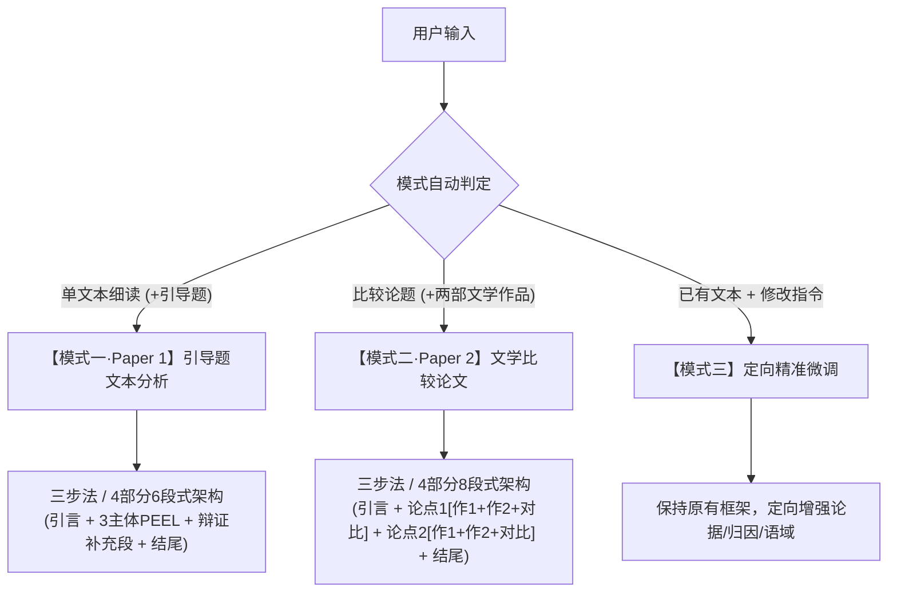

# IB 中文 A 双卷学术写作与文本分析工具 (ZhLanLit-Paper)

**ZhLanLit-Paper** 是专为 **IB DP 语言 A（文学 / 语言与文学）** 打造的高阶学术评论与比较论文生成及优化引擎。本技能由原 `paper1-drafter` 全面迭代升级而来，完整集成 **卷一（Paper 1 引导题文本分析）** 与 **卷二（Paper 2 文学作品比较学术论文）** 双重核心架构。

全文输出严格遵循规范现代标准汉语（简体中文），学术语域纯正典雅、思辨严密，全面对标 IB 官方 Level 7（满分 20/20）评分标准。

---

## 核心功能与两大模式概览



---

## 使用场景与提示词指南

### 1. 【模式一】Paper 1 引导题单文本分析

- **分步引导模式（推荐）**：
  > “请帮我分析这篇 IB 中文散文：[粘贴文本] 引导题：[输入引导题]”  
  > *(AI 将首先执行 Step 1，输出 3 个三维互斥分论点，待用户确认或微调后再生成 Step 2 六段式全文)*

- **直接成文模式**：
  > “请直接为这篇文本撰写完整的 IB 中文 A 卷一分析文章：[粘贴文本] 引导题：[输入引导题]”  
  > *(AI 将连续输出 Step 1 分论点与 Step 2 六段式完整学术评论)*

### 2. 【模式二】Paper 2 文学作品比较论文

- **分步引导模式（推荐）**：
  > “我想写一篇 IB 中文 Paper 2 比较论文。题目是：‘比较作者如何表现希望，取得什么效果’。我选的两部作品是余华《活着》和古华《芙蓉镇》。”  
  > *(AI 首先执行 Step 1，进行审题、提炼总论点 Thesis 以及两个核心比较维度/分论点，待确认后进入全文生成)*

- **直接成文模式**：
  > “请根据题目‘比较作者如何表现女性在父权社会下的觉醒与抗争’，结合曹禺《雷雨》（鲁侍萍/蘩漪）与易卜生《玩偶之家》（娜拉），直接撰写完整的 IB 中文试卷二 8 段式比较学术论文。”  
  > *(AI 连续输出 Step 1 双维度立论与 Step 2 完整的八段式比较分析范文)*

### 3. 【模式三】定向精准微调

- **微调指令示例**：
  > “请在第 4 段和第 7 段对比段中，进一步强化关于余华与古华在‘时代背景与创作意图’上的深层差异分析。”  
  > “请将第 3 段中对《芙蓉镇》次要人物谷燕山的描写再丰富一些，增强与《活着》王喜、长根的呼应。”

---

## 篇章架构与质量准则

### 1. Paper 1 标准六段式架构 (4 部分 / 6 段)
- **第 1 段**：开头段（明确体裁与时代语境，提出中心论点 Thesis，引出三维互斥分论点）。
- **第 2–4 段**：主体分析段（分别对应视角语态、修辞意象、篇章结构三维度，严格践行 **PEEL 微循环**：微观嵌入引文 -> 手法机制解构 -> 审美效果与主旨升华）。
- **第 5 段**：**辩证补充段（Level 7 核心）**（以“固然……然而……”句式剖析手法内在表现力代价与盲区，深化思辨张力）。
- **第 6 段**：结尾段（综合三维论析与辩证思考，升华至形而上哲学与人性探索）。

### 2. Paper 2 标准八段式架构 (4 部分 / 8 段)
- **第 1 段**：开头段（解题破题，介绍两部作品，确立核心总论点 Thesis，列出分论点 1 与分论点 2）。
- **第 2–4 段（第一论点块）**：
  - 第 2 段：作品 1 细读剖析（手法机制 1 运作与效果）。
  - 第 3 段：作品 2 细读剖析（典雅承转词衔接，同类手法运作与效果）。
  - 第 4 段：**对比综合段（求同析异 + 意图与效果归因）**。
- **第 5–7 段（第二论点块）**：
  - 第 5 段：作品 1 细读剖析（具体事物/象征符号/特定载体 2 运作与哲学意蕴）。
  - 第 6 段：作品 2 细读剖析（具体事物/文化线索 2 运作与精神寄托）。
  - 第 7 段：**对比综合段（求同析异 + 生存哲学与时代批判归因）**。
- **第 8 段**：结尾段（回扣论题，总结两大维度比较成果，升华两部作品共同探讨的时代宿命、人性尊严与文学超越性）。

---

## 目录结构与参考文档

```
ZhLanLit-Paper/
├── SKILL.md                                 # 核心指令、双模式路由与质控红线
├── README.md                                # 中文使用指南与提示词手册
└── references/
    ├── ib_chinese_a_framework.md            # Paper 1 评析方法论与学术语体词库
    ├── step_by_step_templates.md            # Paper 1 六段式段落模板与高阶句式库
    ├── ib_chinese_a_paper1_research.md      # Paper 1 官方标准与深度研究报告
    ├── paper2_framework.md                  # Paper 2 比较方法论与四维归因指南
    ├── paper2_templates.md                  # Paper 2 标准八段式比较论文模板与句式库
    ├── paper2_exemplar.md                   # Paper 2 满分范文（《活着》vs《芙蓉镇》）与考官解析
    └── examples.md                          # Paper 1 & Paper 2 满分精选范文库
```
