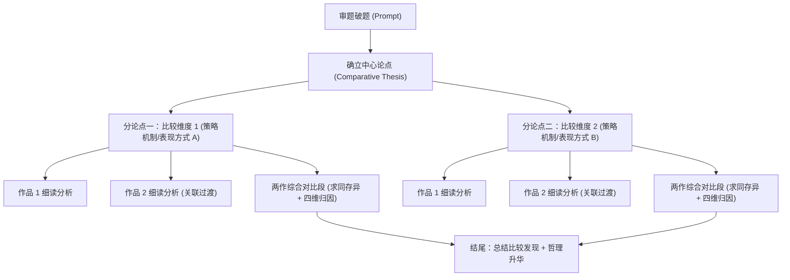

# IB 中文 A Paper 2 双作品比较学术论文方法论与评分指南

本参考指南系统梳理了 **IB DP 语言 A（文学 / 语言与文学）卷二：比较论文（Paper 2: Comparative Essay）** 的官方评估标准、Level 7 满分判分基准、双维度交叉对比方法论、求同析异四维归因体系，以及高阶学术比较关联词汇库。

---

## 一、IB DP 语言 A Paper 2 官方评估标准与 Level 7 判分基准剖析

Paper 2 要求考生针对试卷提供的四道开放式宏观文学题目，任选一题，结合在课程中研读过的**至少两部文学作品（Two Literary Works）**撰写一篇结构严谨、比较深入的学术论文（考试时间 105 分钟，建议篇幅 1200–1600 字）。

### 官方四大评估标准（Criteria A–D）

| 评估标准 | 分值 | Level 7 满分画像 (Insightful & Nuanced) | 常见失分陷阱 (Pitfalls to Avoid) |
| :--- | :---: | :--- | :--- |
| **标准 A：知识、理解与解释** *(Knowledge, Understanding and Interpretation)* | **5 分** | • 对两部作品的主题、情节、人物及深层文化/哲学内涵展现出**敏锐而深刻的洞察**。 • 准确把握文本细节，引述与举证高度确凿，**无任何事实性硬伤或情节误读**。 | • 脱离论题进行冗长的情节复述（Plot summary）。 • 对两部作品的背景或人物设定记忆模糊、混淆细节。 |
| **标准 B：分析与评价** *(Analysis and Evaluation)* | **5 分** | • 精辟剖析作者在文体形式、叙述策略、修辞意象及篇章构造等方面的**艺术选择（Authorial Choices）**。 • 深入评价这些艺术策略如何有效构建意义、唤起读者心理认同或实现审美批判。 | • 仅罗列修辞手法名称（“贴标签”），未深入拆解手法运转机制。 • 忽视作品作为“文学建构”的形式特征，将文学分析降格为社会学漫谈。 |
| **标准 B2：比较分析** *(Comparative Analysis - 核心权重)* | **5 分** | • **势均力敌（Balanced Treatment）**：两部作品在各维度的论述中地位对等、深度均等。 • **求同存异与深层归因**：超越肤浅的现象类比，能深入剖析手法运用异同背后的时代、流派、哲学与意图成因。 | • **单边倾斜**：详写作品A，将作品B作为附庸仅寥寥数笔带过。 • **两张皮并列**：前半篇写A，后半篇写B，缺乏交织对比段与深层归因。 |
| **标准 C：重点与组织** *(Focus and Organization)* | **5 分** | • 全文始终**高度聚焦于题眼**（Prompt Focus），总论点清晰且具有统摄力。 • 篇章逻辑推进层层递进，段落衔接浑然天成，对比段落架构清晰匀称。 | • 偏离题目核心关键词，自说自话准备好的套作素材。 • 段落结构杂乱，缺乏清晰的比较维度和承上启下的过渡机制。 |
| **标准 D：语言规范与学术语体** *(Language)* | **5 分** | • 语言精确典雅、凝练克制，展现纯正的书面现代汉语学术语体。 • 熟练运用高阶文学批评与比较逻辑术语，句式严密多变，零语病。 | • 出现第一人称主观抒情（“我觉得”、“本文认为”）。 • 语言口语化、词汇贫乏或滥用网络流行语。 |

---

## 二、双维度交叉对比方法论 (Dual-Dimension Comparative Framework)

根据教学最佳实践与高分试卷结构（参考《试卷二文章结构》），最稳健且最具深度的 Paper 2 论文架构为 **双维度交叉对比模型（Dual-Dimension Thematic/Stylistic Block Model）**：

### 1. 提炼分论点的三大原则
- **对题目的双向覆盖**：两个分论点必须从不同艺术层面（如：叙事节奏/温情书写 vs. 核心象征物/文化符号）共同回应题目的核心要求。
- **两部作品的并网兼容**：每个分论点必须能够同时统摄两部作品，句式形如：`两个作家都使用了[某种手法/策略机制]来[回应引导题/塑造某种审美效果]`。
- **逻辑递进性**：分论点一通常聚焦于宏观叙事基调、情感氛围或情节铺陈机制；分论点二则通常聚焦于微观象征载体、核心意象系统或特定文化符号，由浅入深，形成从整体到具象的推进。

---

## 三、对比段（Synthesis 段）求同析异的“四维归因体系”

在八段式结构中，第 4 段与第 7 段是检验比较深度的灵魂段落。考官评价考生是否达到 Level 7，关键看对比段能否在指出“异同”的同时完成**深层文学归因**：

| 归因维度 | 核心剖析切入点 | 高阶学术句式示例 |
| :--- | :--- | :--- |
| **一、手法运作机制之异** *(Mechanical Differences)* | 同样的手法，两作者在运用方式上有何差异？（如：前者偏向叙述快慢节奏的对比白描，后者偏向社会群体与个体的强烈反差）。 | *“同样是用苦难衬托希望，《活着》借助对苦难的疾速冷淡叙述与对温情的缓慢聚焦形成张力，而《芙蓉镇》则依托外部社会政治高压与个体秘密施援的强烈伦理反差，凸显了希望的悲壮与圣洁。”* |
| **二、具体事物与意象选取之异** *(Symbolic Selection)* | 寄托主题的具体载体有何不同？（如：前者选取农耕文明中吃苦耐劳的‘老牛’，后者选取承载民间乡土民俗的‘喜歌堂’歌谣）。 | *“在寄托载体的选取上，余华以劳作之‘牛’象征道家顺天安命的朴素耐受力，古华则以湘南民俗‘喜歌堂’承载底层民众面对政治狂热时的精神自治与民间抗争。”* |
| **三、时代语境与创作意图之异** *(Contextual & Intentional Nuances)* | 两位作家的历史视界与问题意识有何不同？（如：一个探讨超越具体政治的人类普遍生存哲学与生命韧性，另一个直击特定历史动荡时期的荒诞社会批判与人性拯救）。 | *“这一手法的分野根植于两作者创作意图的深层差异：余华意在超越具体历史时段，探寻‘活着只是为了活着本身’的生命终极韧性；古华则深植于特定极左时期的历史创伤，旨在对极左政治造成的异化进行深刻的反思与人道主义救赎。”* |
| **四、思想哲学与美学追求之异** *(Philosophical & Aesthetic Vision)* | 文本最终指向的形而上哲学为何？（如：道家自然随顺、向内释然 vs. 儒家伦理温情、向外抗争与公理期盼）。 | *“余华以冷峻零度的笔调将死亡与失去化解于与命运的和解之中，体现了东方虚静随顺的哲学；古华则通过戏剧性的平反与民俗回归，赋予文本强烈的正义昭雪与启蒙人道色彩。”* |

---

## 四、高阶比较与转折学术衔接词库 (Comparative Metalanguage Bank)

Paper 2 的行文极为讲究作品之间的逻辑穿引，杜绝生硬割裂。以下为推荐的高分学术连接短语：

### 1. 求同与类比过渡（用于引出第二部作品）
- **句首承转**：“同样的……”、“与之遥相呼应的是……”、“与作品一异曲同工的是……”、“在相同的艺术探索脉络下……”
- **逻辑契合**：“[作者B]在《[作品B]》中亦秉持着相似的美学追求……”、“这一艺术策略在[作品B]中得到了同样精妙的贯彻……”、“无独有偶，[作品B]亦借助……”

### 2. 对比与辨析衔接（用于对比段展开异同）
- **异同总览**：“对比两部作品，二者虽在[手法机制]上殊途同归，但在[具体呈现维度]上却各具机杼。”
- **由同入异**：“两者固然均以[A手法]作为核心表意载体，然而深入其肌理，不难发现……”
- **深层剖析**：“《[作品A]》着眼于[微观/主体/个体体验]，旨在揭示……；反观《[作品B]》，则更聚焦于[宏观/体制/社会关系]，致力于彰显……”
- **归因总结**：“这种手法的分野，本质上折射出两位作家在[历史视界/美学流派/生命哲学]层面的深刻差异。”

### 3. 高阶批评概念
- **互文呼应**、**同质异构**、**殊途同归**、**各具机杼**、**二元对立**、**张力博弈**、**美学旨趣**、**精神自治**、**时代症候**、**人性救赎**。
