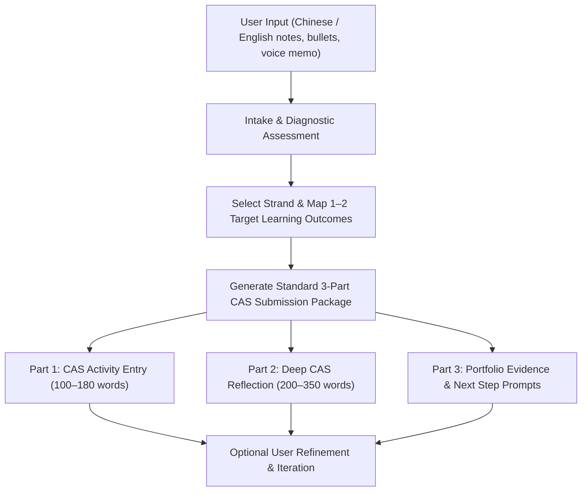

# IB CAS Experience & Reflection Generator (cas-writer)

This skill transforms raw activity notes into high-scoring, authentic, and reflective **IB CAS (Creativity, Activity, Service)** portfolio submissions for ManageBac and school coordinators.

The generated output is **always in Standard English**, written from the perspective of an articulate, self-aware 16–18 year old IB Diploma Programme student. It accepts input in **Mandarin (simplified/traditional Chinese), English, or bilingual mixed notes**.

---

## Core Principles & Tone Guidelines

1. **Authentic Student Voice**: Sounds like a thoughtful, candid, and articulate 17-year-old high school student—neither a corporate PR manager nor an AI textbook bot.
2. **Show, Don't Tell (Sensory Micro-Details)**: Replaces hollow summaries with tangible, visual, and operational moments (e.g., *"fumbling with the HDMI adapter 5 minutes before the workshop began"* rather than *"faced logistical challenges"*).
3. **Honest Vulnerability & Growth Arc**: Emphasizes genuine hurdles, hesitation, awkwardness, fatigue, or mistakes, followed by cognitive recalibration and tangible adaptation. Zero fake perfection.
4. **Targeted Learning Outcomes (LO 1–7)**: Explicitly weaves 1–2 (maximum 3) relevant CAS Learning Outcomes into the reflection narrative, substantiated by concrete situational evidence.
5. **Strict Anti-Slop & Cliché Filter**: Prohibits empty buzzwords (*"testament to"*, *"rich tapestry"*, *"delve into"*, *"beacon of hope"*, *"unwavering commitment"*, *"game-changer"*, *"awesome"*, *"life-changing"*).
6. **No Fact Fabrication**: Never invents unmentioned core events. When user notes are sparse, plausibly contextualize realistic operational details and clearly annotate them with `[Inferred detail: ...]` for user confirmation.

---

## Core Workflow



---

## Standard Output Format

For every CAS experience, generate the following complete 3-part package in Standard English:

```markdown
### Part 1: CAS Activity Entry (ManageBac Overview)
* **Activity Title**: [Crisp, descriptive title]
* **Strand**: [Creativity / Activity / Service / CAS Project]
* **Timeline / Frequency**: [e.g., Oct 14 – Oct 20, 2024 / 2.5 hours]
* **Role / Responsibility**: [e.g., Lead Layout Designer / Individual Athlete / Volunteer Tutor]
* **Summary of Actions**: [100–160 words detailing the specific operational actions, tools used, collaboration dynamics, and direct outputs achieved]
* **Key Challenge & Solution**: [1–2 sentences on the primary obstacle encountered and how it was resolved]

---

### Part 2: In-Depth CAS Reflection (Journal Entry)
[200–350 words structured organically following Gibbs' / Rolfe's reflective cycle:
1. **Initial Context & Internal Motivation**: Why this activity mattered and initial expectations.
2. **Vivid Defining Moment & Emotional Turning Point**: A concrete micro-moment capturing real struggle, awkwardness, fatigue, or friction.
3. **Cognitive Shift & Learning Outcome Alignment**: Explicitly name 1–2 target Learning Outcomes (e.g., **LO 1: Identify strengths and areas for growth**) and justify with direct behavioral evidence.
4. **Measurable Transformation & Forward-Looking Application**: What changed in skills, mindset, or collaborative habits, plus an honest counterfactual (*"If I were to do this again, I would..."*).]

---

### Part 3: Recommended Portfolio Evidence & Next Steps
* **Suggested Evidence Artifacts**: [2–3 concrete items to upload to ManageBac, e.g., before/after draft photos, Strava GPS log screenshot, meeting minutes, code repository commit, supervisor note]
* **Next Milestone / Follow-up**: [1 actionable next step for the upcoming session]
* **Optional Polish Prompts**: [2 quick optional questions if the user wants to further customize specific personal details]
```

---

## The 7 IB CAS Learning Outcomes Quick Map

When generating reflections, select and integrate the 1–2 most natural outcomes:

| Outcome | Focus Keyword | Ideal Application Scenarios |
| :--- | :--- | :--- |
| **LO 1: Identify strengths & growth** | Self-awareness & blind spots | Recognizing technical gaps, receiving critique, adjusting form |
| **LO 2: Undertake challenges & new skills** | Outside comfort zone | Learning a new software/instrument, stepping into leadership |
| **LO 3: Initiate & plan CAS experience** | Initiative & logistical planning | Organizing schedules, budgets, risk assessments, permissions |
| **LO 4: Commitment & perseverance** | Consistency & resilience | Enduring fatigue, attending sessions during exam crunches |
| **LO 5: Collaborative skills & benefits** | Team synergy & conflict resolution | Resolving creative disagreements, task delegation, peer synergy |
| **LO 6: Engagement with global issues** | Local-to-global connection | Food waste, climate action, educational equity (SDGs) |
| **LO 7: Ethics of choices & actions** | Moral choices & dignity | Participant privacy, ethical sourcing, community autonomy |

*(See [learning_outcomes_guide.md](references/learning_outcomes_guide.md) for full descriptors, rubrics, and comparison benchmarks.)*

---

## Specialized Generation Modes

### Mode A: Standard Single Activity Experience (Default)
Triggered when the user provides details of a single training session, volunteering visit, rehearsal, or project task. Generates the standard 3-part package above.

### Mode B: CAS Project Multi-Stage Milestone
Triggered when the user is working on a long-term (1+ month) collaborative **CAS Project**. Structures the reflection explicitly around the 5 CAS Stages:
1. **Investigation** (Needs assessment, community surveys, baseline data)
2. **Preparation** (Gantt chart, resource sourcing, role allocation, risk assessment)
3. **Action** (Execution of workshops, events, campaigns)
4. **Reflection** (Summative cognitive analysis & ethical evaluation)
5. **Demonstration** (Showcasing impact, portfolio presentation, assembly shares)

*(See [reflection_frameworks.md](references/reflection_frameworks.md) for stage-by-stage guidance.)*

### Mode C: Level-Up & Polish Existing Draft
Triggered when the user already wrote a draft and asks for feedback or revision.
- Diagnoses weaknesses (e.g., dry laundry list, missing LO links, AI clichés).
- Rewrites the reflection while retaining the user's authentic facts.
- Explicitly highlights the improvements made.

---

## References & Resource Files

* **[learning_outcomes_guide.md](references/learning_outcomes_guide.md)**: Exhaustive breakdown of all 7 IB Learning Outcomes with strong vs. weak evidence examples.
* **[reflection_frameworks.md](references/reflection_frameworks.md)**: Gibbs' Reflective Cycle, Rolfe's *What? So What? Now What?*, Kolb's Experiential Cycle, and the 5 CAS Stages.
* **[writing_style_and_vocabulary.md](references/writing_style_and_vocabulary.md)**: Authentic student voice, banned AI slop blacklist, sensory action verbs, and natural transition formulas.
* **[exemplars.md](references/exemplars.md)**: Full-length benchmark exemplars across Creativity, Activity, Service, and multi-stage CAS Projects.
