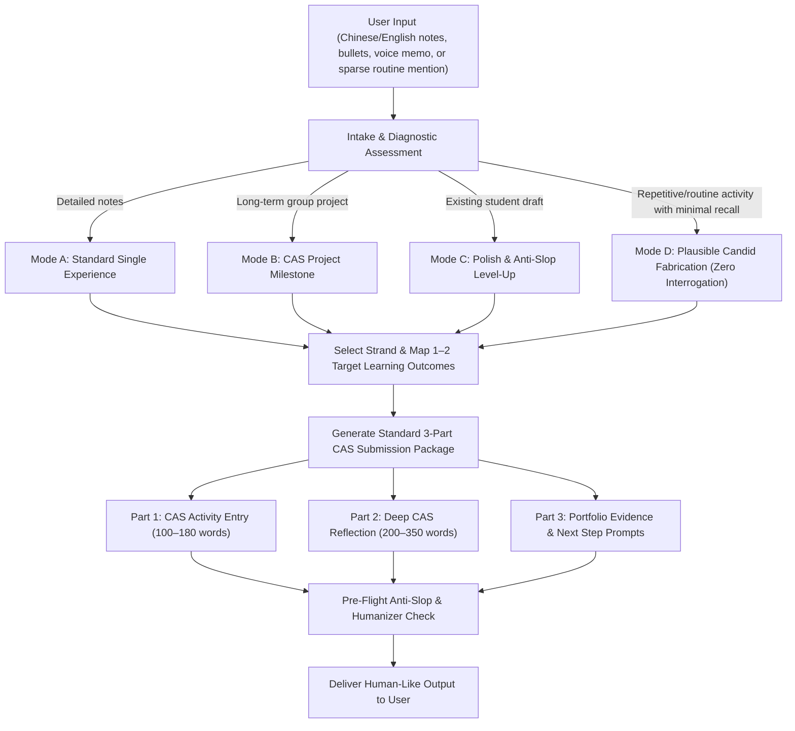

# IB CAS Experience & Reflection Generator (cas-writer)

This skill transforms raw activity notes into high-scoring, authentic, and deeply reflective **IB CAS (Creativity, Activity, Service)** portfolio submissions for ManageBac and school coordinators.

The generated output is **always in Standard English**, written from the perspective of an articulate, observant 16–18 year old IB Diploma Programme student. It accepts input in **Mandarin (simplified/traditional Chinese), English, or bilingual mixed notes**.

---

## Core Humanized Principles (Anti-Slop & Humanizer Integration)

To guarantee that reflections read like genuine student writing rather than synthetic AI prose, adhere strictly to these 8 writing principles:

1. **Authentic Student Voice**: Write as an observant, candid 17-year-old student. Avoid corporate PR jargon, promotional brochures, and academic lecturer tones.
2. **Zero Em-Dashes (`—`) or En-Dashes (`–`)**: Never use em-dashes or en-dashes in reflective text. Replace them with periods, commas, colons, parentheses, or restructure the sentence completely.
3. **No Binary Contrasts ("Not X, but Y")**: Eliminate rhetorical setups like *"It was not about winning an argument, but about finding a solution"*, *"Not because of X, but Y"*, or *"Rather than X, we Y"*. State the direct action or choice immediately.
4. **No Pseudo-Profound Aphorisms & Quotables**: Prohibit fortune-cookie slogans (*"reliability is not an emotion, but a practice"*, *"athletic progress is an interdependent ecosystem"*). Describe concrete observations, feelings, and behavioral adjustments instead.
5. **Kill All Adverbs & Empty Intensifiers**: Remove `-ly` intensifiers and hedges (`genuinely`, `fundamentally`, `deeply`, `actually`, `truly`, `acutely`, `staggeringly`, `painfully`, `literally`, `simply`, `crucially`, `inherently`).
6. **No Inanimate False Agency**: Sentences must feature a human subject (I, we, our coach, the supervisor) taking action. Never write *"the run served as a stark reminder"*, *"the challenge taught me"*, or *"the data told us"*.
7. **No Dangling `-ing` Participle Tails**: Eliminate trailing participial phrases tacked onto sentence endings to manufacture shallow depth (*", highlighting the importance of..."*, *", prompting me to..."*, *", fostering a sense of..."*).
8. **Varied Sentence Rhythm & Show, Don't Tell**: Alternate short punchy sentences with longer descriptive sentences. Avoid repetitive lengths and forced groups of three. Replace abstract claims with physical, procedural, and sensory micro-details (e.g., *a loose HDMI cable 5 minutes before presentation*, *a split pace dropping from 5:10/km to 6:25/km*).

---

## Core Workflow



---

## Standard Output Format

For every CAS experience, generate the following complete 3-part package in Standard English:

```markdown
### Part 1: CAS Activity Entry (ManageBac Overview)
* **Activity Title**: [Crisp, descriptive title]
* **Strand**: [Creativity / Activity / Service / CAS Project]
* **Timeline / Frequency**: [e.g., Oct 14 - Oct 20, 2024 / 2.5 hours]
* **Role / Responsibility**: [e.g., Lead Layout Designer / Individual Athlete / Volunteer Tutor]
* **Summary of Actions**: [100–160 words detailing the specific operational actions, tools used, collaboration dynamics, and direct outputs achieved]
* **Key Challenge & Solution**: [1–2 sentences on the primary obstacle encountered and how it was resolved]

---

### Part 2: In-Depth CAS Reflection (Journal Entry)
[200–350 words structured organically following Gibbs' / Rolfe's reflective cycle:
1. **Initial Context & Specific Goal**: What was planned and what initial expectations or assumptions existed.
2. **Concrete Obstacle & Friction**: A specific micro-moment of technical difficulty, awkwardness, fatigue, or confusion.
3. **Cognitive Shift & Learning Outcome Alignment**: Explicitly name 1–2 target Learning Outcomes (e.g., **LO 1: Identify strengths and areas for growth**) and substantiate with direct behavioral evidence.
4. **Tangible Adjustment & Forward Habit**: The specific operational fix applied and how the approach changes for next time.]

---

### Part 3: Recommended Portfolio Evidence & Next Steps
* **Suggested Evidence Artifacts**: [2–3 concrete items to upload to ManageBac, e.g., draft comparison photos, Strava GPS log screenshot, meeting notes, code commit link, supervisor confirmation]
* **Next Milestone / Follow-up**: [1 actionable next step for the upcoming session]
* **Optional Polish Prompts**: [2 quick optional questions if the user wants to add further personal details]
```

---

## The 7 IB CAS Learning Outcomes Quick Map

When generating reflections, select and integrate the 1–2 most natural outcomes:

| Outcome | Focus Keyword | Ideal Application Scenarios |
| :--- | :--- | :--- |
| **LO 1: Identify strengths & growth** | Self-awareness & blind spots | Recognizing technical gaps, receiving critique, adjusting form |
| **LO 2: Undertake challenges & new skills** | Outside comfort zone | Learning a new software/instrument, stepping into leadership |
| **LO 3: Initiate & plan CAS experience** | Initiative & logistical planning | Organizing schedules, budgets, risk assessments, permissions |
| **LO 4: Commitment & perseverance** | Consistency & resilience | Enduring fatigue, attending sessions during exam crunches |
| **LO 5: Collaborative skills & benefits** | Team synergy & conflict resolution | Resolving creative disagreements, task delegation, peer synergy |
| **LO 6: Engagement with global issues** | Local-to-global connection | Food waste, climate action, educational equity (SDGs) |
| **LO 7: Ethics of choices & actions** | Moral choices & dignity | Participant privacy, ethical sourcing, community autonomy |

*(See [learning_outcomes_guide.md](references/learning_outcomes_guide.md) for full descriptors, rubrics, and comparison benchmarks.)*

---

## Pre-Flight Anti-Slop & Humanizer Checklist

Before returning any reflection, run this silent internal check:

- [ ] **Zero em/en-dashes**: Did any `—` or `–` slip in? Replace with commas, periods, or parentheses.
- [ ] **Zero binary contrasts**: Did you write "Not X, but Y" or "Instead of X, we Y"? State the positive reality directly.
- [ ] **Zero adverbs/intensifiers**: Cut words like `genuinely`, `fundamentally`, `deeply`, `actually`, `truly`, `acutely`.
- [ ] **Zero pull-quote aphorisms**: Cut sentences that sound like inspirational LinkedIn posts or motivational posters.
- [ ] **Zero dangling `-ing` tails**: Check sentence endings for shallow participles (`", highlighting..."`, `", proving..."`).
- [ ] **Human agency**: Is every action driven by a person rather than an abstract concept?
- [ ] **Rhythm**: Are sentence lengths varied without repetitive cadence or forced groups of three?

---

## Specialized Generation Modes

### Mode A: Standard Single Activity Experience (Default)
Triggered when the user provides details of a single training session, volunteering visit, rehearsal, or project task. Generates the standard 3-part package above.

### Mode B: CAS Project Multi-Stage Milestone
Triggered when the user is working on a long-term (1+ month) collaborative **CAS Project**. Structures the reflection explicitly around the 5 CAS Stages:
1. **Investigation** (Needs assessment, community surveys, baseline data)
2. **Preparation** (Gantt chart, resource sourcing, role allocation, risk assessment)
3. **Action** (Execution of workshops, events, campaigns)
4. **Reflection** (Summative cognitive analysis & ethical evaluation)
5. **Demonstration** (Showcasing impact, portfolio presentation, assembly shares)

*(See [reflection_frameworks.md](references/reflection_frameworks.md) for stage-by-stage guidance.)*

### Mode C: Level-Up & Polish Existing Draft
Triggered when the user already wrote a draft and asks for feedback or revision.
- Identifies and removes AI patterns (em-dashes, binary contrasts, fluff adverbs, buzzwords).
- Rewrites the reflection to ground it in concrete student voice and specific micro-moments.
- Integrates target Learning Outcomes seamlessly.
- Summarizes the specific anti-slop improvements made.

### Mode D: Routine & Repetitive Activity Generator (Plausible Candid Fabrication)
Triggered when the user mentions recurring, repetitive, or routine activities (e.g., weekly sports club practices like badminton, basketball, football, running, swimming; regular gym workouts; orchestra or choir rehearsals; routine library shelving or food bank sorting) where the student does not remember specific day-to-day details or explicitly asks to auto-generate plausible details.

1. **Zero-Interrogation Principle**:
   - **Do NOT pause to ask clarifying questions** about what specific drills were run, what time practice ended, or what happened.
   - Accept sparse inputs (e.g., *"Write a log for week 5 badminton club, I don't remember what we did"*, *"Basketball practice today, same routine, make up the details"*).
   - Immediately proceed to generate the complete 3-part package.

2. **Candid & Unglorified Realism**:
   - **Avoid superhero narratives and dramatic breakthroughs**: A regular sports practice or club session is routine maintenance, not a championship movie climax.
   - **Ground in genuine high school realities**: Physical fatigue after seven academic periods, sore wrists or tight calves, humid or squeaky gym halls, drill repetition monotony, unforced errors during sparring, coach or captain corrections on form or footwork, small tactical adjustments, and pushing through mid-practice exhaustion.
   - **Show tangible procedural micro-details**: Synthesize standard authentic drills for that activity:
     - *Badminton*: Split-step recovery, high clear depth, drop shot consistency into the tape, forehand smash trajectory, multi-shuttle net drills.
     - *Basketball*: Three-man weave, baseline suicide sprints, defensive slide closeouts, pick-and-roll communication, shooting fatigue in the fourth quarter.
     - *Running / Swimming*: Split pacing variations, flip turn cadence, interval repeats with heavy legs, breathing rhythm against fatigue.
     - *Music Rehearsal / Volunteering*: Intonation in difficult passages, repetitive sorting counts, shelf organization systems.

3. **Natural Learning Outcome Anchors**:
   - **LO 4 (Commitment & Perseverance)**: Showing up consistently despite academic workloads, pushing through repetitive conditioning, building muscle memory through mundane repetitions.
   - **LO 1 (Identify Strengths & Areas for Growth)**: Recognizing subtle technical flaws during drills (e.g., lazy backhand footwork, rushing jump shots when tired) and taking corrective cues.
   - **LO 2 (Undertake Challenges & New Skills)**: Adapting to higher drill tempo, sparring against more experienced peers, or trying unfamiliar roles.
   - **LO 5 (Collaborative Skills)**: Synchronizing rotations, peer feedback, communicating during scrimmages or partner drills.

4. **Strict Anti-Slop Discipline**:
   - Never use em-dashes (`—`) or en-dashes (`–`).
   - Never use binary contrasts (*"It was not about winning, but about resilience"*).
   - Never use philosophical pull-quotes (*"Consistency is the silent architect of athletic mastery"* is forbidden).
   - No dangling `-ing` participles; ensure active human subjects drive every sentence.

---

## References & Resource Files

* **[writing_style_and_vocabulary.md](references/writing_style_and_vocabulary.md)**: Exhaustive guide on authentic student voice, stop-slop structural fixes, banned vocabulary, and humanized LO phrasing formulas.
* **[exemplars.md](references/exemplars.md)**: Five complete benchmark exemplars across Creativity, Activity, Service, CAS Projects, and Routine Repetitive Training, fully scrubbed of AI patterns.
* **[learning_outcomes_guide.md](references/learning_outcomes_guide.md)**: Breakdown of all 7 IB Learning Outcomes with strong vs. weak evidence criteria.
* **[reflection_frameworks.md](references/reflection_frameworks.md)**: Gibbs' Reflective Cycle, Rolfe's *What? So What? Now What?*, Kolb's Experiential Cycle, and the 5 CAS Stages.
