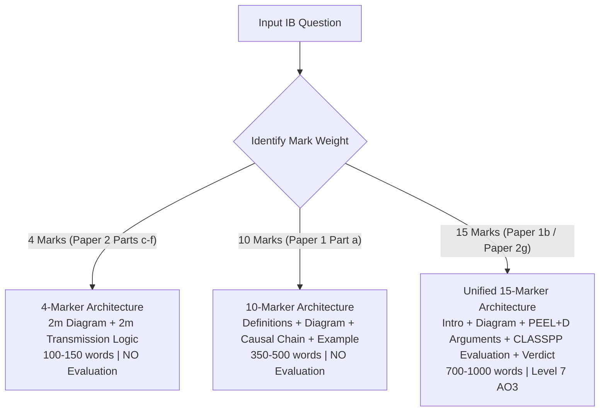
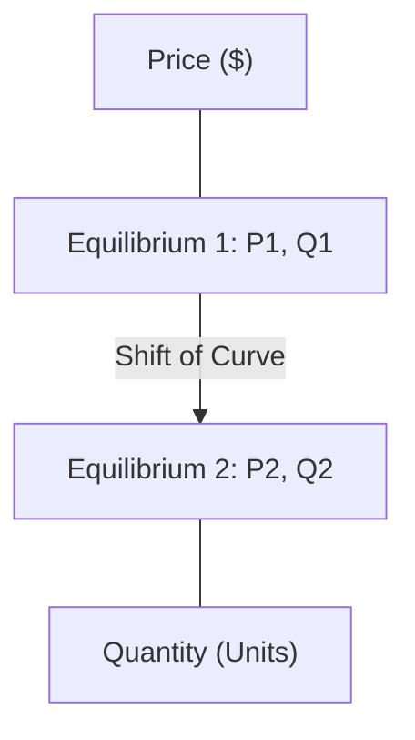

# IB Economics Answer Drafter (SL & HL)

A specialized skill for generating Level 7 (top markband) responses for **IB DP Economics Paper 1 and Paper 2** examinations.

All drafted responses and diagram analyses are produced in **Pure English Exam Standard**, adhering strictly to official International Baccalaureate assessment objectives (AO1–AO4), command terms, and holistic markbands.

---

## 1. Pre-Draft Clarification Workflow ("Prompt Before Proceeding")

When a user provides an exam question, stimulus, or prompt, **always pause and prompt the user to confirm preferences before generating the draft**, unless they have already specified them upfront.

Present this structured pre-flight menu:

```markdown
### 📋 IB Economics Draft Setup
To tailor the answer to your exact exam needs, please confirm your preferences (or reply with your preferred numbers):

1. **Syllabus Level**:
   - [A] **Standard Level (SL)** (Default — strictly excludes HL-only extensions)
   - [B] **Higher Level (HL)** (Enables HL extensions, theory of the firm, market structures, etc.)

2. **Workflow Mode**:
   - [1] **Structured Outline First** (Review question breakdown, definitions, diagram choice, and thesis before drafting)
   - [2] **Instant Level 7 Full Draft** (Generate the complete exam-ready response directly)
   - [3] **Guided Step-by-Step Writing Tutor** (Draft section-by-section with interactive review)

3. **Diagram Presentation Format**:
   - [1] **Diagram Blueprint & Instructions** (Detailed coordinate box + step-by-step drawing steps + in-text prose analysis)
   - [2] **Visual Diagram** (Mermaid/ASCII schematic inline + in-text prose analysis)
   - [3] **Pure In-Text Prose** (Standard essay paragraph explanation without a separate blueprint block)

4. **Real-World Evidence (15-markers only)**:
   - [A] **Auto-select Canonical Real-World Example** (Specific dated policy, statistics, and country context from bank)
   - [B] **Custom Case Study / Text Extract** (You provide the article text or case example)

5. **Examiner Diagnostic Checklist**:
   - [Yes] Append an IB Level 7 Markband Diagnostic Checklist at the end
   - [No] Output essay draft only
```

*Override rule*: If the user provides clear instructions upfront (e.g., *"Draft a 15-marker on indirect taxes with a blueprint diagram and checklist"*), bypass the clarification menu and execute immediately using sensible defaults (SL, Mode 2, Diagram Option 1, Canonical RWE, Checklist included).

---

## 2. Core Question Type Architectures



---

### 2.1 4-Mark Questions (Paper 2, Parts c–f)
*Target*: Exact analytic markscheme (2 marks for diagram, 2 marks for transmission logic). Word count: **100–150 words**.

* **Formatting Rules**:
  1. **Zero Fluff**: Do NOT write an introduction, background, or conclusion.
  2. **Zero Evaluation**: Strictly prohibit pros/cons, evaluation, or judgment. (Awards 0 marks and wastes time).
  3. **Strict 2-Part Structure**:
     - **Part 1: Diagram Specification**: Precise axes, curve shifts, and equilibrium points $(P_1, Q_1 \to P_2, Q_2)$.
     - **Part 2: Transmission Mechanism**: Step-by-step causal chain explaining *why* the curve shifted and the market mechanism driving price and quantity to the new equilibrium.

* **Standard 4-Mark Template**:
```markdown
### Diagram Specification
- **X-axis**: [Quantity of Good X / Real GDP / Quantity of Currency]
- **Y-axis**: [Price of Good X ($) / Average Price Level / Exchange Rate]
- **Curves**: Initial curves [e.g. S1 and D1] intersecting at equilibrium ($P_1, Q_1$).
- **Shift**: [Curve] shifts to [New Curve, e.g. S2] due to [reason], indicated by a rightward/leftward arrow.
- **New Equilibrium**: Market settles at ($P_2, Q_2$).

### Economic Explanation
[1-2 sentences on the initial cause/shock from the text/scenario]. As a result, [specific curve] shifts [left/right] from [C1] to [C2]. At the initial price [P1], there is an excess [demand/supply] of [Q1-Q...]. This shortage/surplus exerts [upward/downward] pressure on price until a new market equilibrium is established at price [P2] and quantity [Q2].
```

---

### 2.2 10-Mark Questions (Paper 1, Part a)
*Target*: Level 4 Markband (9–10 marks). Word count: **350–500 words**.

* **Core Assessment Requirements**:
  - **AO1 (Knowledge & Understanding)**: Define all key economic terms embedded in the question.
  - **AO4 (Diagrammatic Skills)**: Accurate, fully labeled diagram with explicit textual integration.
  - **AO2 (Analysis & Application)**: Complete causal chain of economic transmission ($X \to Y \to Z$).
  - **Contextual Illustrative Example**: Mention a concrete market/scenario demonstrating the theory.
  - **STRICT PROHIBITION**: **Never include AO3 evaluation or critique**.

* **Standard 10-Mark 4-Section Architecture**:
  1. **Definitions (AO1)**: Define 2–3 key technical terms appearing in the question using formal economic phrasing.
  2. **Diagram Blueprint & Drawing Steps (AO4)**: Complete diagram specifications and coordinate shifts.
  3. **Step-by-Step Transmission Analysis (AO2)**: Walk through the diagram systematically:
     - Free market starting equilibrium ($P_1, Q_1$).
     - The economic shock/policy mechanism.
     - Disequilibrium dynamics (excess supply/demand) driving price signals.
     - Final equilibrium outcome ($P_2, Q_2$) and impacts on revenue, surplus, or employment.
  4. **Contextual Application / Illustrative Case (AO2)**: Brief application to a real-world market (e.g. wheat market for price floors, oil market for supply shocks) to anchor the theoretical explanation.

---

### 2.3 Unified 15-Mark Essay Framework (Paper 1 Part b & Paper 2 Part g)
*Target*: Level 5 Markband (13–15 marks / Level 7). Word count: **700–1000 words**.

* **Unified Dynamic Framework**:
  - If **Paper 1 Part b**: Incorporate fully developed **Canonical Real-World Examples** (names, policies, dates, statistics). Consult `references/canonical_rwe_bank.md`.
  - If **Paper 2 Part g**: Directly quote and synthesize the **Provided Text and Data Extracts** from the case study stimulus.
  - In both papers, deploy the **PEEL+D** paragraph model and **CLASSPP** evaluation matrix. Consult `references/evaluation_frameworks.md`.

* **Standard 15-Mark 6-Part Structure**:

| Section | Content & Level 7 Criteria |
| :--- | :--- |
| **1. Introduction** | • Define all core economic terms in the question.<br>• Provide economic context.<br>• Formulate an explicit, nuanced **Thesis Statement** forecasting the evaluated arguments. |
| **2. Diagram Blueprint & Theoretical Core** | • Diagram specification box (axes, curves, shifts, equilibrium coordinates, shaded welfare loss/gain).<br>• In-text walkthrough integrating the diagram into the primary economic theory. |
| **3. Body Paragraph 1: Primary Argument (PEEL+D)** | • **P**: State the primary theoretical benefit/impact.<br>• **E**: Detailed transmission mechanism linked to diagram.<br>• **E**: Empirical RWE facts (Paper 1) or cited extract figures (Paper 2).<br>• **D (Dialectical Limitation)**: Immediate counter-point / caveat (e.g. inelasticity, deadweight loss). |
| **4. Body Paragraph 2: Alternative / Counter Policy (PEEL+D)** | • **P**: Counter-perspective, unintended consequence, or alternative policy.<br>• **E**: Detailed economic transmission mechanism.<br>• **E**: Empirical or case-study evidence.<br>• **D (Dialectical Limitation)**: Limitations of the counter-policy (e.g. government failure, budget deficit). |
| **5. Synthesis & Deep Evaluation (AO3 - CLASSPP)** | • Systematic evaluation using selected dimensions from **CLASSPP**:<br>  - **Short-run vs. Long-run** dynamics.<br>  - **Stakeholder Analysis** (Consumers, Producers, Government, Low-income groups).<br>  - **Trade-offs** (Equity vs. Efficiency, Inflation vs. Unemployment).<br>  - **Challenging Assumptions** (ceteris paribus, rationality, elasticities). |
| **6. Substantiated Conclusion** | • **Step 1: Definitive Verdict** answering the command term.<br>• **Step 2: Decisive Contingency** (The crucial "It depends on..." factor: PED, fiscal capacity, or time horizon).<br>• **Step 3: Synthesized Policy Mix** (e.g. pairing market incentives with hypothecated government investment). |

---

## 3. Diagram Presentation Options

When drafting, format diagrams according to the user's selected preference:

### Option 1: Diagram Blueprint & Step-by-Step Instructions (Default)
```markdown
#### 📊 Diagram Blueprint: [Diagram Title]
| Component | Specification |
| :--- | :--- |
| **Y-Axis** | Price of [Good X] ($ / unit) |
| **X-Axis** | Quantity of [Good X] (units per time period) |
| **Initial Curves** | Demand ($D_1 = MPB$), Supply ($S_1 = MPC$) |
| **Initial Equilibrium** | $E_1$ at $(Q_1, P_1)$ |
| **Shift / Change** | [Curve] shifts vertically to [New Curve] by distance equal to [tax/subsidy] |
| **New Equilibrium** | $E_2$ at $(Q_2, P_2)$ |
| **Welfare / Key Areas** | Deadweight loss triangle bounded by coordinates [...]; Tax revenue box [...] |

**Step-by-Step Drawing Instructions for Student**:
1. Draw and label the vertical axis as "Price ($)" and horizontal axis as "Quantity (Q)".
2. Plot downward-sloping curve $D_1$ and upward-sloping curve $S_1$, marking intersection $E_1$ at $(Q_1, P_1)$.
3. Draw a new curve parallel to [S1/D1], adding a directional arrow to show the shift.
4. Mark the new intersection $E_2$ at $(Q_2, P_2)$ and shade the area representing [DWL / surplus].
```

### Option 2: Visual ASCII / Mermaid Schematic

*(Combined with a full coordinate breakdown and in-text prose analysis).*

### Option 3: Pure In-Text Prose
Integrate all diagram movements seamlessly into the narrative paragraphs without a separate Markdown table, explicitly naming curve shifts and equilibrium transitions ($P_1 \to P_2$).

---

## 4. Post-Draft Examiner Diagnostic Checklist

When requested (or when defaults are accepted), append this diagnostic checklist at the end of the response:

```markdown
---
### 🎓 IB Examiner Markband Diagnostic Checklist
- [x] **AO1 Knowledge & Terms**: Precise definitions provided for all command terms and key concepts.
- [x] **AO2 Economic Reasoning**: Step-by-step causal chain ($A \to B \to C$) established without missing links.
- [x] **AO4 Diagram Precision**: Full axes labels, curve identifiers, shift vectors, and equilibria indicated.
- [x] **AO3 Evaluation & Balance (15m only)**: Balanced debate executed via CLASSPP, stakeholder disaggregation, and a substantiated 3-step conclusion.
- [x] **Evidence & Context**: Concrete empirical RWE (Paper 1) or explicit extract citations (Paper 2) integrated.
- **Estimated Markband**: **Level 7** (14–15 / 15 for 15-marker; 9–10 / 10 for 10-marker; 4 / 4 for 4-marker).
---
```

---

## 5. Reference Libraries

Consult the bundled reference guides for exhaustive details:
- **`references/markbands_and_command_terms.md`**: Complete official IB markband descriptors and command term taxonomy.
- **`references/diagram_specs.md`**: Detailed blueprints for all Micro, Macro, and Global economy diagrams.
- **`references/canonical_rwe_bank.md`**: High-scoring real-world examples with dates, statistics, and country contexts.
- **`references/evaluation_frameworks.md`**: In-depth application of CLASSPP, STEEP, PEEL+D, and conclusion models.
