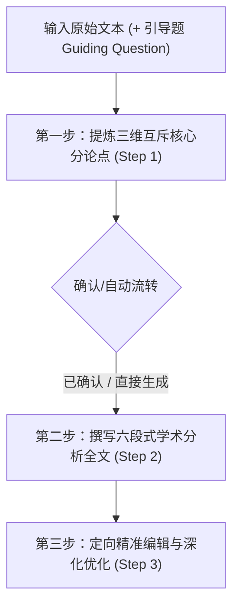

# IB 中文 A 卷一（Paper 1）文本分析与学术评论工作流

本技能专门用于生成、构建和优化 **IB DP 语言 A（文学 / 语言与文学）卷一：引导题文本分析（Paper 1: Guided Textual Analysis / Commentary）**。

全文输出必须统一采用**规范现代标准汉语（简体中文）**，语言严谨、典雅、克制，杜绝口语化与第一人称主观抒情，严格贯彻 IB 官方 Level 7（满分 20/20）评分标准与高阶文学批评方法论。

---

## 核心工作流：严格三步法 (3-Step Core Workflow)



---

## 第一步：提炼三维互斥核心分论点 (Step 1: Sub-Argument Extraction)

### 任务目标
通读用户提供的文本及引导题，从形式特征与意义构建的深层联系出发，提炼出 **三个在维度上严格互斥、在逻辑上层层递进、在功能上共同支撑文本主旨** 的核心分论点。

### 五大约束与质控规范
1. **严格基于显性文本证据**：分论点必须源自文本客观存在的形式与艺术特征（如叙述视角、修辞语义场、篇章时空结构、多模态视觉元素等），严禁脱离文本凭空臆造。
2. **维度互斥且互不重叠（三维分类学）**：
   - **维度一（视角与语调）**：叙述者立场（内聚焦/限知/全知）、叙述视距调控、语气语调（冷峻克制/反讽/悲悯）、读者心理契约。
   - **维度二（修辞、词汇与意象）**：词汇语义场、感官通感、延伸隐喻与象征系统、句式修辞（对偶/排比/层递）。
   - **维度三（篇章结构与时空演进）**：时空蒙太奇、二元对立张力、叙事节奏（张弛/突转 Volta）、环形呼应或开放留白。
   - *（非文学多模态可选扩展）*：视觉显著性（Salience）、视线向量、色彩象征、图文定锚（Anchorage）与图文接力（Relay）。
3. **“策略机制 + 审美效果 + 主旨功能”标准公式**：
   每个分论点必须完整包含三要素：`[作者运用的艺术策略/手法机制] + [产生的即时文学/修辞/心理效果] + [如何服务于核心主题/引导题要求]`。
4. **抽象度适中**：既不可过于琐碎（如“第三段第二行用了比喻”），亦不可空泛无物（如“作者用了丰富的修辞”），必须是能统领多处细节证据的分析框架。
5. **输出格式规范**：直接输出三个标题式陈述，每点一行，语言凝练精准。

### 第一步标准输出格式
```markdown
### 第一步：三维互斥核心分论点提炼
1. **[维度一：叙述视角与语态]**：[策略机制 + 即时审美效果 + 核心主旨与读者效应]
2. **[维度二：修辞机制与意象符号]**：[策略机制 + 即时审美效果 + 核心主旨与读者效应]
3. **[维度三：篇章结构与时空张力]**：[策略机制 + 即时审美效果 + 核心主旨与读者效应]
```

---

## 第二步：撰写六段式学术分析全文 (Step 2: Full Essay Drafting)

### 任务目标
基于原文本、引导题与已确立的三个分论点，撰写一篇 **逻辑严密、细读深入、富有辨析力的高分学术评论全文**（约 1000–1400 字，简体中文）。

### 篇章架构：标准 4 部分 / 6 段式模型

| 部分 | 段落划分 | 写作规范与论证要点 |
| :--- | :--- | :--- |
| **一、开头段 (Introduction)** | 第 1 段 | • 简要明确文本体裁、时代语境、核心议题与作者整体意图。<br>• 紧扣引导题提出中心论点（Thesis Statement），并**明确带出三个分论点**，展现宏观论证框架。<br>• 奠定严谨、客观、思辨的学术语调。 |
| **二、主体分析段 (Body Paragraphs)** | 第 2 段 (分论点1)<br>第 3 段 (分论点2)<br>第 4 段 (分论点3) | **严格执行“引用—分析—作用”三阶细读微模型（PEEL）**：<br>1. **引用 (Quote)**：精准嵌入 1–2 处微观词句（杜绝生硬抛掷大段原句，将引文自然编织进分析语流）。<br>2. **分析 (Analysis)**：深入解构手法机制（选词内涵义 Connotation、修辞张力、感官通感、语气变化）。<br>3. **作用 (Function)**：阐明该艺术效果如何服务于核心主题传达、读者心理重构或深层哲学反思。 |
| **三、辩证补充段 (Dialectical Limitation)** | 第 5 段 | **考查 Level 7 辨析力的核心段落（位于主体段之后、结尾段之前）**：<br>• **内在局限剖析**：基于文本显性特征，客观指出该手法/视角背后的内在局限（如微观视角对宏观社会结构的遮蔽、感性情感过载对理性论证的挤压、二元对立构图对现实复杂性的简化等）。<br>• **平衡句式**：采用“固然……然而……”、“尽管……不可否认……”等客观克制句式，**严禁脱离文本的场外道德说教或否定前文论证**。<br>• **张力升华**：阐明该局限如何与前述优势形成辩证互补，深化全文的审美与思辨张力。 |
| **四、结尾段 (Conclusion)** | 第 6 段 | • 综合三个主体分论点与辩证补充段的洞察，回扣开头核心论点与引导题。<br>• 升华文本在文学美学、文化批评或人性探索维度的普遍意义，给出克制而有力的学术收束。 |

### 第二步质量红线
- **证据锚定**：所有论析与辩证均严格基于原文，零外部虚构。
- **语体控制**：使用第三人称学术客观语体，彻底根除“我认为”、“笔者觉得”、“我们应该”等第一人称或口语化表达。
- **排版要求**：以连贯流畅的学术散文段落呈现，正文内部不堆砌小标题。

---

## 第三步：定向精准编辑与深化优化 (Step 3: Targeted Refinement)

### 任务目标
当用户提出修改指令（如扩充字数、深化特定意象分析、强化辩证段张力、调整语体风格）时，在**不破坏原有六段式逻辑框架**的前提下进行精准微调。

### 修改原则与策略
1. **指令解析优先**：准确识别用户意图（深度拓展、论据强化、辩证深化、语域润色）。
2. **维持有机性与框架稳定性**：保留“引言—3主体段—辩证段—结尾”结构及“引用—分析—作用”链条不变。
3. **扩充深化策略**：增加对原文次要细节词汇的微观剖析，展开双重象征意义或感官隐喻链条。
4. **辩证强化策略**：更精准地锚定手法付出的表现力代价，强化批判性思维张力。

---

## 交互与执行模式

1. **分步引导模式（默认推荐）**：
   - 收到用户文本后，首先执行 **第一步**，输出 3 个三维互斥分论点，等待用户确认或微调，确认后再生成 **第二步** 完整范文。
2. **端到端一键生成模式**：
   - 若用户明确要求“直接生成完整分析文章”或提供文本的同时催促成文，连续输出 **第一步分论点** 与 **第二步六段式完整评论全文**。
3. **定向微调模式**：
   - 用户提供已有分析文本并提出修改要求时，直接执行 **第三步**，并附带修改要点说明。

---

## 附录与参考资源

- [IB 中文 A 评析方法论与学术语体词库](references/ib_chinese_a_framework.md)
- [六段式段落模板与高阶句式库](references/step_by_step_templates.md)
- [文学与非文学 7 分满分范文库](references/examples.md)
- [IB 中文 A Paper 1 官方标准与研究报告](references/ib_chinese_a_paper1_research.md)
